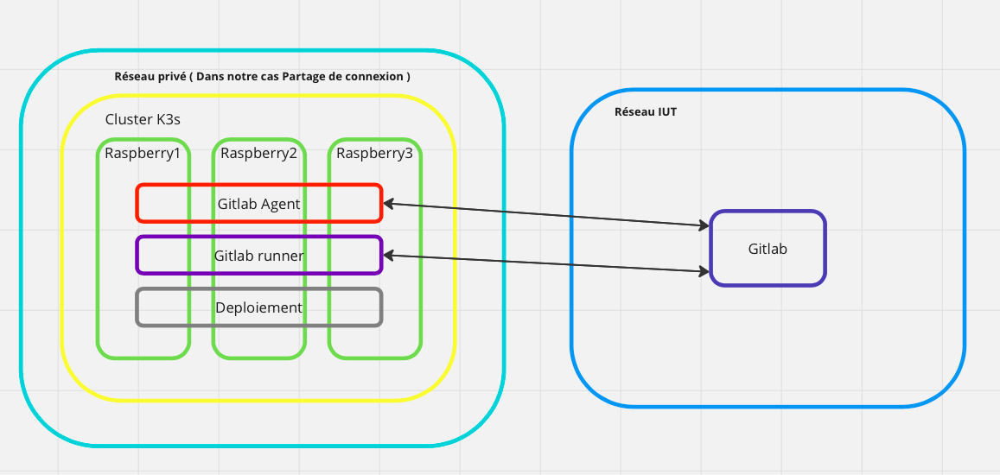

# Brawl Stars Stats

Application web de visualisation de statistiques [Brawl Stars](https://brawlstars.com/) :
trophées, historiques de combats et graphiques de progression pour un ensemble de
joueurs suivis.

Le projet est conteneurisé avec Docker et déployé sur un cluster Kubernetes (k3s)
via une pipeline GitLab CI/CD.



## Fonctionnalités

- Récupération des données joueurs via l'API officielle Brawl Stars.
- Suivi de l'évolution des trophées dans le temps (graphiques Chart.js).
- Consultation de l'historique de combats (battle logs).
- Rafraîchissement automatique des données via une tâche planifiée (cron).
- Mise en cache des appels API pour limiter les requêtes.

## Stack technique

| Domaine        | Technologies                          |
| -------------- | ------------------------------------- |
| Backend        | Node.js, Express                      |
| Vues           | EJS                                   |
| Graphiques     | Chart.js                              |
| Planification  | node-cron                             |
| Tests          | Jest, Supertest                       |
| Qualité        | ESLint                                |
| Conteneur      | Docker                                |
| Déploiement    | Kubernetes (k3s), GitLab CI/CD        |

## Prérequis

- Node.js 18.x (ou 16.x)
- npm
- Une clé d'API Brawl Stars (voir [developer.brawlstars.com](https://developer.brawlstars.com/))

## Installation

```bash
npm install
```

## Configuration

L'application a besoin d'une clé d'API Brawl Stars. Celle-ci **ne doit jamais être
commitée** : renseignez-la via une variable d'environnement (par exemple dans un
fichier `.env` local, ignoré par git).

```bash
export BRAWL_API_KEY="votre-cle-api"
export PORT=8000            # optionnel, 8000 par défaut
```

> Les clés d'API sont personnelles et restreintes par plage d'adresses IP côté
> Brawl Stars. Pensez à autoriser l'IP de la machine (ou du cluster) qui exécute
> l'application.

## Lancement

En local :

```bash
npm start
```

L'application est alors disponible sur `http://localhost:8000`.

Avec Docker :

```bash
docker build -t brawl-stars-stats .
docker run -p 8000:8000 -e BRAWL_API_KEY="votre-cle-api" brawl-stars-stats
```

## Tests et qualité

```bash
npm test     # lance les tests Jest
npm run lint # analyse ESLint des fichiers JavaScript
```

## Structure du projet

```
.
├── app.js              # Point d'entrée Express (routes, cron, vues)
├── routes/             # Routeurs Express (pages et appels API)
├── public/
│   ├── css/            # Feuilles de style
│   ├── js/             # Scripts client et données mises en cache
│   └── src/            # Images (brawlers, logos)
├── views/              # Templates EJS
├── tests/              # Tests Jest
├── mocks/              # Mocks pour les tests
├── kubernetes/         # Manifestes de déploiement (Deployment, Service, Ingress)
├── Dockerfile
└── .gitlab-ci.yml      # Pipeline CI/CD
```

## Pipeline CI/CD

La pipeline GitLab est composée de quatre étapes exécutées dans l'ordre. L'échec
d'une étape interrompt les suivantes.

```
build ──► test ──► lint ──► deploy
```

- **build** — construit l'image Docker à partir du `Dockerfile` et la pousse sur le
  registry de conteneurs.
- **test** — exécute la suite de tests Jest (`npm test`).
- **lint** — vérifie la qualité du code JavaScript avec ESLint (`npm run lint`),
  sur la base de la configuration `eslint:recommended`.
- **deploy** — applique les manifestes du dossier `kubernetes/` sur le cluster.

## Déploiement Kubernetes

Le dossier `kubernetes/` contient les manifestes nécessaires :

- `dep-brawl-life.yml` — le *Deployment* de l'application (basé sur l'image du registry).
- `svc-clusterip-dep-brawl-life.yml` — le *Service* ClusterIP.
- `ing-app-brawl-life.yml` — l'*Ingress* exposant l'application.

L'application est déployée sur un cluster k3s. Les nœuds doivent partager le même
réseau pour que le déploiement et l'exposition fonctionnent.

## Auteurs

Projet réalisé dans un cadre scolaire (IUT) par l'équipe : Rémy Riole, Lucas Dubois,
Florent Chappellier, et contributeurs.

## Licence

Distribué sous licence MIT.
